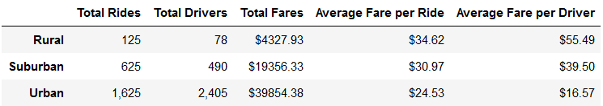
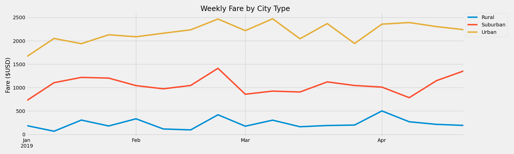

# An Analysis of PyBer Ride-Sharing Data

## Overview of Project

This project analyzes data from the ride-sharing company, PyBer, to calculate and visualize the total weekly fares earned in urban, suburban, and rural cities.

## Results

Our analysis reveals that there are significant differences in the total rides, total drivers, and total fares in urban vs suburban vs rural cities. Urban cities have by far the most rides, drivers, and subsequently fares in comparison to suburban and rural cities, as can be seen in the chart below.

Although urban cities have the highest total fares, the increase in fares compared to suburban and rural cities is not proportioanl to the increase in total rides and drivers. As a result, the average fare per ride in urban cities is actually significantly lower compared to fares in suburban and rural cities, making PyBer a more cost effective transportation option for urban dwellers. Similarly, the average fare per driver is the lowest in urban cities, making each ride less profitable for urban drivers as compared to suburban and rural drivers.

The chart above provides a week by week comparison of fares in each city type, demonstrating that the disparity in the fares earned in each city type is consistent over time. Urban cities consistently out earn suburban and rural cities, and suburban cities consistently out earn rural cities. 

## Summary

Based on the data above, it seems that PyBer's algorithm works in such a way that the more total drivers and/or rides there are in a city, the cheaper the fare for the ride. One result of this is that rides in urban cities are significantly lower than rides in suburban and rural cities, which may contribute to a reaffirming bahavioral pattern where urban city dwellers use PyBer more often because it is more cost effective, pushing down ride prices even more and encouraging more people to use the service.

Suburban and rural cities are inevitably at a disadvantage profit-wise due to the fact that these cities have lower populations and therefore less people who can take rides. However, PyBer may be able to encourage more people in suburban and rural cities to use PyBer (and use it more often) if the fares in those cities were lower. 

If PyBer's current algorithm bases its ride fare on the number of drivers currently out and available in the city, PyBer could aim to lower fares by recruiting more drivers in suburban and rural cities. 

PyBer could also choose to adjust its algorithm for suburban and rural cities so that the average fare in these cities is closer to the average fare in urban cities, but at lower thresholds of total rides and/or total drivers. Once the algorithm gets adjusted, we can test whether the cost incentive will drive user participation up enough to make up for the lowered prices. If not, we can conclude that the disparity in total rides is a result of the population disparities in different city types, rather than a result of ride fare disparity. 
